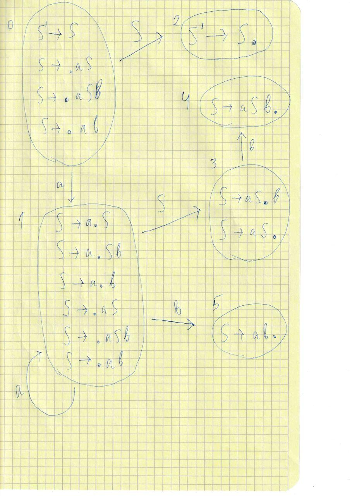

### Грамматика

1) S -> aSb
2) S -> aS
3) S -> ab

Тогда букв b в получившемся слове будет меньше, так как в каждом правиле их меньше. Букв b не 0, так как завершиться вывод может только 3 правилом.  
ab получается из 3 правила, a...ab получается из 2 и 3. При равном количестве букв a и b, из правил 1 и 3. А в остальных случаях из 1 2 и 3.  

### SLR(1)
  

Тогда рассмотрим клетку 3b. С одной стороны там есть s4, так как есть переход из 3 состояния в 4. И там так же есть r2(нумерация правил сверху), так как b принадлежит Follow(S) и в 3 состоянии есть конечный item. Получается конфликт и это не SLR(1) грамматика.